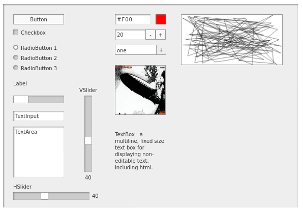

# minimalcomps2

Pure HTML/JS reimagining of https://github.com/minimalcomps/minimalcomps

Implemented using Web Components and Shadow DOM. Probably imperfectly.

Still a work in progress, but coming along nicely. Better than I had hoped.

## Goals

A single-file, drop-in library allowing you to create a quick user interface for experiments or quick ideas.

The aim is for very concise, compact syntax. You can usually create a component, position it, configure it and create and event handler in a single line of code. Example:

```
const panel = new Panel(document.body, 40, 40, 200, 200);
new Button(panel, 20, 20, "Click me", () => label.text = input.text);
const input = new TextInput(panel, 20, 50, "hello world");
const label = new Label(panel, 20, 80, "target label");
```

Which give you this:


The general API for each component is 

```new ComponentName(parent, x, y, <possible other params>, defaultEventHandler);```

No need to worry about styles or layout. Just give everything an absolute x, y position.

## What they look like



## Live Demos

[Live Demos](https://bit101.github.io/minimalcomps2/)

## Documentation

[Documentation](https://github.com/bit101/minimalcomps2/wiki)

### Use

There are two files in the `dist` directory:

- `minimalcomps.js`- You can drop this in a project with a script tag and access all components via the `mc2` global object:
  - `new mc2.Button(panel, 20, 20, "Click me", handler);`
  - Example in `demos/globaldemo/`

- `minimalcomps.mjs` - This is for use with JS modules.
  - `import { Button } from "./minimalcomps.mjs";`
  - `new Button(panel, 20, 20, "Click me", handler);`
  - No need to add the file in your HTML.
  - Your main script will need to have `type="module"` defined in order to import the classes.
  - You'll need a server running to run this locally. You can't import JS modules from the file system.
  - Example in `demos/moduledemo/`

When things get a bit more polished, I'll create an npm module.
